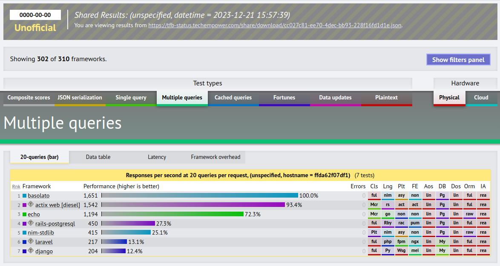

<p align="center">
  
</p>
<div align="center">
  <h1>Basolato Framework</h1>
  
</div>

---

An asynchronous multiprocessing full-stack web framework for Nim, based on [asynchttpserver](https://nim-lang.org/docs/asynchttpserver.html).

:warning: This project is under heavy development. It's not yet production-ready. :warning:

The only supported OS are Alpine, Debian, and Ubuntu. 

```dockerfile
FROM ubuntu:22.04

# prevent timezone dialogue
ENV DEBIAN_FRONTEND=noninteractive

RUN apt update --fix-missing && \
    apt upgrade -y
RUN apt install -y --fix-missing \
        gcc \
        g++ \
        xz-utils \
        ca-certificates \
        curl \
        git \
        sqlite3 \
        libpq-dev \
        libmariadb-dev \
        libsass-dev

ARG VERSION="2.0.0"
WORKDIR /root
RUN curl https://nim-lang.org/choosenim/init.sh -o init.sh
RUN sh init.sh -y
RUN rm -f init.sh
ENV PATH $PATH:/root/.nimble/bin
RUN choosenim ${VERSION}

ENV PATH $PATH:/root/.nimble/bin
WORKDIR /root/project
COPY ./basolato.nimble .
RUN nimble install -y -d
RUN git config --global --add safe.directory /root/project
```


## Table of Contents

<!--ts-->
* [Basolato Framework](#basolato-framework)
   * [Table of Contents](#table-of-contents)
   * [Introduction](#introduction)
      * [Set up your environment](#set-up-your-environment)
      * [Dependencies](#dependencies)
      * [Installation](#installation)
      * [Creating projects](#creating-projects)
   * [Documentation](#documentation)
   * [Benchmark](#benchmark)
   * [Roadmap](#roadmap)
   * [Development](#development)
      * [Generate TOC of documents](#generate-toc-of-documents)

<!-- Created by https://github.com/ekalinin/github-markdown-toc -->
<!-- Added by: root, at: Sat Jun 22 11:25:29 UTC 2024 -->

<!--te-->


## Introduction
Basolato extends [asynchttpserver](https://nim-lang.org/docs/asynchttpserver.html), an implements a high performance asynchronous HTTP server in Nim std library, while also adding features for full-stack development. It was also heavily inspired by other frameworks:

|Language|Framework|
|---|---|
|Ruby|Rails|
|PHP|Laravel|
|Python|Masonite|
|Java/Scala|Play|
|Go|Revel|

### Set up your environment
In order to start using Basolato, you'll first need a working Nim installation. You can find installation instructions for Nim [here](https://nim-lang.org/install.html).
Once installed, make sure Nimble, Nim's package manager, is already in your PATH. If not, add `.nimble/bin` in your favorite shell.

```sh
export PATH=$PATH:~/.nimble/bin
```


### Dependencies

The framework depends on several libraries (installed automatically by Nimble):
- [allographer](https://github.com/itsumura-h/nim-allographer), a library for building queries.
- [bcrypt](https://github.com/runvnc/bcryptnim), used for hashing passwords.
- [faker](https://github.com/jiro4989/faker), for generating fake data.
- [sass](https://github.com/dom96/sass), provides a Sass/SCSS to CSS compiler for `Nim` through bindings to `libsass`.


### Installation

You can install Basolato easily using Nimble:

```sh
nimble install https://github.com/itsumura-h/nim-basolato
```

After installing Basolato, you should have access to the `ducere` command on your shell.

### Creating projects

Using `ducere` you can easily create a template project structure to start development right away. Ducere will generate a folder automatically using your project name.

```sh
cd /your/project/dir
ducere new {project_name}
```

The overall file structure is as follows:

```
├── app
│   ├── data_stores
│   │   ├── queries
│   │   └── repositories
│   ├── di_container.nim
│   ├── http
│   │   ├── controllers
│   │   │   └── welcome_controller.nim
│   │   ├── middlewares
│   │   │   ├── auth_middleware.nim
│   │   │   └── set_headers_middleware.nim
│   │   └── views
│   │       ├── errors
│   │       ├── layouts
│   │       │   ├── application_view.nim
│   │       │   └── head_view.nim
│   │       └── pages
│   │           └── welcome_view.nim
│   ├── models
│   └── usecases
├── config
│   └── database.nim
├── config.nims
├── database
│   ├── develop.sh
│   ├── migrations
│   │   ├── default
│   │   │   └── migrate.nim
│   │   └── test
│   │       └── migrate.nim
│   ├── production.sh
│   ├── seeders
│   │   ├── data
│   │   │   └── sample_seeder.nim
│   │   ├── develop.nim
│   │   ├── production.nim
│   │   └── staging.nim
│   └── staging.sh
├── main.nim
├── public
│   ├── basolato.svg
│   ├── css
│   ├── favicon.ico
│   └── js
├── resources
│   └── lang
│       ├── en
│       │   └── validation.json
│       └── ja
│           └── validation.json
├── {project_name}.nimble
└── tests
    └── test_sample.nim
```

With your project ready, you can start serving requests using `ducere`:

```sh
ducere serve # includes hot reloading
> Run server for development

ducere build
./startServer
> Run server for production 
```

## Documentation

<details><summary>English</summary><div>

- [ducere CLI tool](./documents/en/ducere.md)
- [Settings](./documents/en/settings.md)
- [Environment helpers](./documents/en/env.md)
- [Routing](./documents/en/routing.md)
- [Controller](./documents/en/controller.md)
- [Request](./documents/en/request.md)
- [Middleware](./documents/en/middleware.md)
- [Header](./documents/en/header.md)
- [Migration](./documents/en/migration.md)
- [View](./documents/en/view.md)
- [Static files](./documents/en/static_files.md)
- [Error](./documents/en/error.md)
- [Validation](./documents/en/validation.md)
- [Security (CsrfToken, Cookie, Session, Client)](./documents/en/security.md)
- [Helper](./documents/en/helper.md)
- [Logging](./documents/en/logging.md)

</div></details>

<details><summary>日本語</summary><div>

- [ducere CLI tool](./documents/ja/ducere.md)
- [設定](./documents/ja/settings.md)
- [環境変数ヘルパー](./documents/ja/env.md)
- [ルーティング](./documents/ja/routing.md)
- [コントローラー](./documents/ja/controller.md)
- [リクエスト](./documents/ja/request.md)
- [ミドルウェア](./documents/ja/middleware.md)
- [ヘッダー](./documents/ja/header.md)
- [マイグレーション](./documents/ja/migration.md)
- [ビュー](./documents/ja/view.md)
- [静的ファイル](./documents/ja/static_files.md)
- [エラー](./documents/ja/error.md)
- [バリデーション](./documents/ja/validation.md)
- [セキュリティ (CsrfToken, クッキー, セッション, Client)](./documents/ja/security.md)
- [ヘルパー](./documents/ja/helper.md)
- [ログ](./documents/ja/logging.md)

</div></details>

## Benchmark
- https://github.com/the-benchmarker/web-frameworks
- https://www.techempower.com/benchmarks/#section=test&shareid=cc027c81-ee70-4dec-bb93-228f16fd1d1e&hw=ph&test=query




## Roadmap

|Version|Content|
|---|---|
|v1.0|Support Clean architecture and Tactical DDD|
|v2.0|Support GraphQL|

## Development

### Generate TOC of documents

Run.

```bash
nimble setupTool # Build docker image
nimble toc # Generate TOC
```
