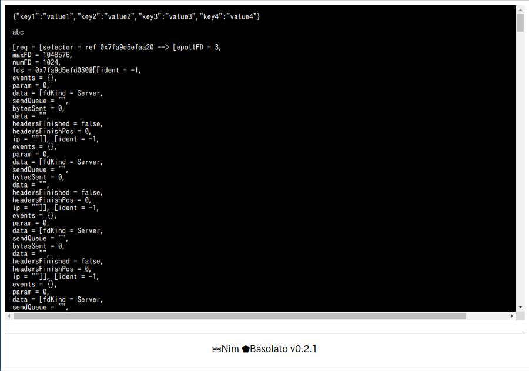

Healper
===
[back](../README.md)

Table of Contents

<!--ts-->
   * [Healper](documents/helper.md#healper)
      * [dd](documents/helper.md#dd)

<!-- Added by: runner, at: Wed Jul 29 09:34:27 UTC 2020 -->

<!--te-->

## dd
```
proc dd(outputs:varges[string])
```
`dd()` is essentially adding a break point in your code which dumps the properties of an object to your browser.  
This proc is only available in develop mode.

```nim
var a = %*{
  "key1": "value1",
  "key2": "value2",
  "key3": "value3",
  "key4": "value4",
}
dd($a,　"abc",　this.request.repr)
```


