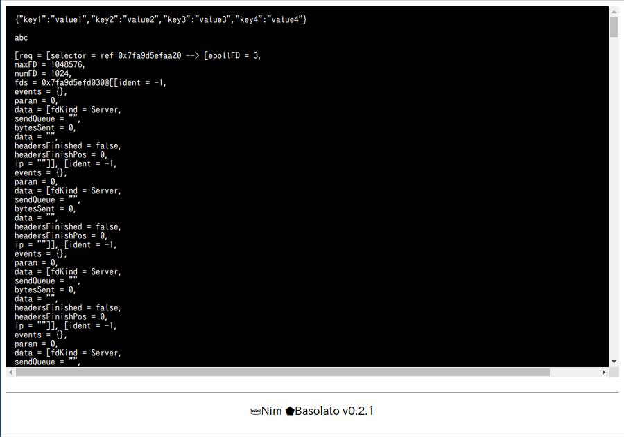

ヘルパー関数
===
[戻る](../../README.md)

コンテンツ

<!--ts-->
   * [Healper](#healper)
      * [dd](#dd)

<!-- Added by: root, at: Sun Dec 27 18:18:55 UTC 2020 -->

<!--te-->

## dd
```
proc dd(outputs:varges[string])
```

`dd`関数はソースコードの中にブレークポイントを発生させ、引数に入れている文字列をブラウザに表示させます。
この機能は開発環境でのみ有効になります。

```nim
var a = %*{
  "key1": "value1",
  "key2": "value2",
  "key3": "value3",
  "key4": "value4",
}
dd($a,　"abc", request.repr)
```


